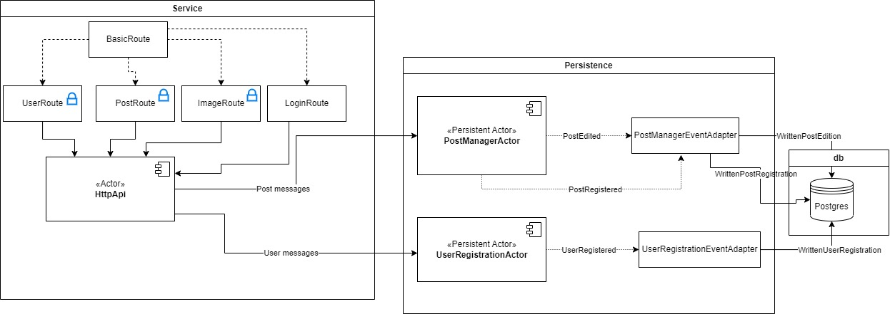

# Social App - Cesar Purper

The solution was developed using scala and the Akka toolkit. 


## Architecture

The architecture looks as follows:




Using postgres as database the app has two actors to persist events, the PostManagerActor and the UserRegistrationActor. 
Between these actors and the database there is a event adapter to each actor. this event adapter is responsble to convert actor events into database events. This adapter helps with schema evolution, since the actor is not aware of these database schema changes, it just send the same event.

The HttpApi handles all web server related work, including authentiaction and its start routine. It creates the routing with the routes objects.

The webserver routes are split in 4 objects, UserRoute, PostRoute, ImageRoute and LoginRoute. The HttpApi actor consolidates all these objects in a unique routing, putting the routes that need authentication under the "authenticated" Directive, created inside the HttpApi actor. This Directive will get the jwt token from request, checks its validity and get its claims.

There is a NetworkManagerActor in the actors package, this actor was an attempt to implement the capability of 'following and get notifications from posts'. Since I wasn't being able to figure out the best way to architecture it in the project, I focuesed in the minimum requirements and left out the 'Nice to have' requirements to a future implementation. 


## Running tests

To run tests open the app project folder and run the tests

```bash
  cd social-app-cesar-vigil
  sbt test
```


## How to run it

After cloning the repository we need to build the docker image from sbt build. From the root folder run the following commands:

```bash
  cd social-app-cesar-vigil
  sbt docker:publishLocal
```

A docker image will be published to the host docker daemon, if you want to check if it worked, from the root folder run the following commands:

```bash
  docker ps
```

With the docker image built, all that left to do is to run the docker compose command and start the application and the postgres database.

In the project root folder:
```bash
  docker-compose up -d
```

> *-d is to run it in detached mode*


## API Endpoints

#### Login

```http
  GET /api/socialApp/login
```

| Header parameter   | Type       | Description                           |
| :---------- | :--------- | :---------------------------------- |
| `userName` | `string` | **Required**. The name of the user trying to authenticate |
| `userEmail` | `string` | **Required**. The email of the user trying to authenticate |

If the login is succesful, this call returns a Status code OK with a JWT token in the header parameter "X-Access-Token"

#### Return all users

```http
  GET /api/socialApp/user/all
```

#### Return an user

```http
  GET /api/socialApp/user/${id}
```

| Parameter   | Type       | Description                                   |
| :---------- | :--------- | :------------------------------------------ |
| `id`      | `int` | **Required**. The user id which the information is being queried  |

#### Create an user

```http
  POST /api/socialApp/user/create
```

| Parameter   | Type       | Description                                   |
| :---------- | :--------- | :------------------------------------------ |
| `userName` | `Multipart.FormData` | **Required**. The name of the user being created |
| `userEmail` | `Multipart.FormData` | **Required**. The email of the user being created |

This endpoint is expecting data to come as Form fields.


#### Create a Post

```http
  POST /api/socialApp/post/create/${userId}
```

| Parameter   | Type       | Description                                   |
| :---------- | :--------- | :------------------------------------------ |
| `userId` | `int` | **Required**. The id of the user creating the post |
| `content` | `Multipart.FormData` | **Required**. The content of the post being created |
| `image` | `Multipart.FormData` | The image of the post being created |

This endpoint is expecting post data to come as Form fields. 


#### Edit a Post

```http
  POST /api/socialApp/user/edit/${postId}
```

| Parameter   | Type       | Description                                   |
| :---------- | :--------- | :------------------------------------------ |
| `postId` | `int` | **Required**. The id of the post being edited |
| `content` | `Multipart.FormData` | **Required**. The new content of the post being edited |
| `image` | `Multipart.FormData` | The new image of the post being edited |

This endpoint is expecting post data to come as Form fields. 


#### Get all posts

```http
  GET /api/socialApp/posts/${sortOrderAsc}/${userId}
```

| Parameter   | Type       | Description                                   |
| :---------- | :--------- | :------------------------------------------ |
| `sortOrderAsc` | `int(1/0)` | **Required**. The sort order option. 1 is ascending, 0 is descending. The posts are sorted by the 'createdDate' |
| `userId` | `int` | **Required**. The user which posts will be queried. If the userId is 0 all the posts are going to be retrieved. If a number greater than 0 is given, it will try to get posts from given userId  | 


#### Get image

```http
  GET /api/socialApp/image/${imageName}
```

| Parameter   | Type       | Description                                   |
| :---------- | :--------- | :------------------------------------------ |
| `imageName` | `string` | **Required**. The image name of a file. It will get the image from the default image folder and provide it|


## Future Improvements

- Implement snapshot logic
- Change file logic to a separate actor
- Check extension of sent image file
  - When the file is being uploaded, the app not checks it for a image file
- Configure custom serializer.
  - The project is using Java default serializer which is not the Best practice. 
- Create tests for routes
  - I had trouble trying to create tests for the Route object, this is a MUST DO in the future
- Indentify and change inplace variables for environment variables
- Make the network actor works with the environment developed
- Create a notification actor the broadcast notifications to multiple sources


